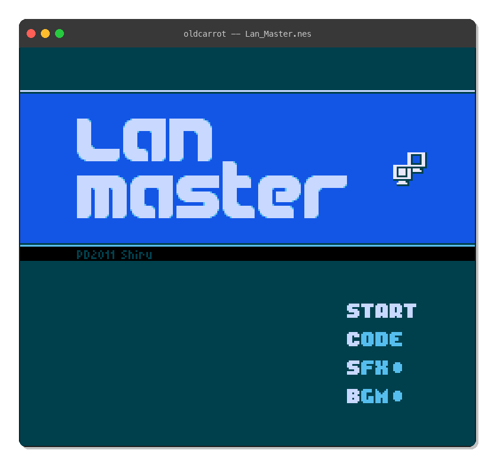

# oldcarrot

A working NES emulator written in [Ruby 0.49](https://github.com/sampersand/ruby-0.49) -- the oldest surviving version of Ruby, from 1994.

Ported from [optcarrot](https://github.com/mame/optcarrot/) by mame.



## Why?

Ruby 0.49 predates most of what makes modern Ruby convenient. There are no blocks as we know them, no string interpolation, no `Fiber`, no `Proc`, no `send()`, no `method()`, no `Array#map`, and only 32-bit signed integers. Writing an NES emulator in it is an exercise in working with severe constraints.

The language differences from modern Ruby are substantial:

| Modern Ruby | Ruby 0.49 |
|---|---|
| `"hello #{name}"` | `sprintf("hello %s", name)` |
| `items.map { \|x\| x + 1 }` | `do items.each() using x; ... end` |
| `class Foo < Bar` | `class Foo : Bar` |
| `CONSTANT` | `%CONSTANT` |
| `begin/rescue` | `protect/resque` |
| `raise` | `fail()` |
| `x > 0 ? "yes" : "no"` | `if x > 0; "yes"; else; "no"; end` |

## Features

- Full 6502 CPU with all official and undocumented opcodes
- PPU with background/sprite rendering, scrolling, sprite-0 hit
- APU with all 5 channels (2x Pulse, Triangle, Noise, DMC)
- NROM mapper (mapper 0) support
- Sixel terminal display (for sixel-capable terminals)
- PPM frame dumping
- Headless benchmark mode

## Usage

Requires the [ruby-0.49](https://github.com/sampersand/ruby-0.49) interpreter. Install via:

```
gem install ancient_ruby
```

### Benchmark (headless)

```
ruby-0.49 oldcarrot.rb <rom_file> [frames]
```

### Sixel display

```
ruby-0.49 oldcarrot_sixel.rb <rom_file> [frames] [scale]
```

Renders frames in the terminal using Sixel graphics. Requires a sixel-capable terminal (iTerm2, WezTerm, foot, mlterm, xterm). Pass `0` for frames to run indefinitely.

### Frame dumping

```
ruby-0.49 dump_frames.rb <rom_file> [frames] [output_dir]
```

Outputs PPM image files, convertible to PNG with ImageMagick.

**Note:** Only NROM (mapper 0) ROMs are supported. The emulator will fail with a clear error on other mappers.

## Benchmark

Measured on an Apple M1 Max running Lan Master for 180 frames:

| Implementation | Ruby version | FPS | Checksum |
|---|---|---|---|
| optcarrot (reference) | 3.3 | ~52 | 59662 |
| oldcarrot | 0.49 | ~4.8 | 56574 |

oldcarrot runs at roughly 8% of the speed of the original optcarrot, which is surprisingly close given that Ruby 0.49 lacks most performance-relevant features. The ~5% checksum difference is due to fine PPU timing details, not rendering errors -- background tiles, sprites, and palette are all correct.

## Architecture

| File | Lines | Description |
|---|---|---|
| `oldcarrot.rb` | ~100 | Entry point and NES orchestrator |
| `lib/cpu.rb` | ~1800 | 6502 CPU with case-based opcode dispatch |
| `lib/ppu.rb` | ~1200 | PPU state machine (replaces Fiber from optcarrot) |
| `lib/apu.rb` | ~1200 | All 5 audio channels + mixer |
| `lib/rom.rb` | ~150 | iNES ROM loader (NROM/mapper 0) |
| `lib/pad.rb` | ~110 | Controller input handling |
| `lib/palette.rb` | ~65 | Pre-computed 512-color NES palette |
| `lib/sixel.rb` | ~130 | Sixel graphics encoder with RLE |

### Key porting decisions

- **No Fiber** -- PPU uses a state machine (`case @hclk`) instead of cooperative multitasking
- **No `send()`** -- CPU opcode dispatch uses a ~800-line `case @opcode` statement
- **No `method()` callbacks** -- CPU memory mapping uses direct dispatch in `fetch()`/`store()`
- **No TILE_LUT** -- Tile pixels are computed inline; the original 2M-entry lookup table can't fit in Ruby 0.49's memory
- **`&` precedence** -- Ruby 0.49's `&` has lower precedence than `==`, requiring careful parenthesization throughout

## Credits

- [optcarrot](https://github.com/mame/optcarrot/) by Yusuke Endoh (mame) -- the original Ruby NES emulator
- [ruby-0.49](https://github.com/sampersand/ruby-0.49) by sampersand -- the restored Ruby 0.49 interpreter
- [Lan Master](https://shiru.untergrund.net/software.shtml) by Shiru -- public domain NES game used for testing
